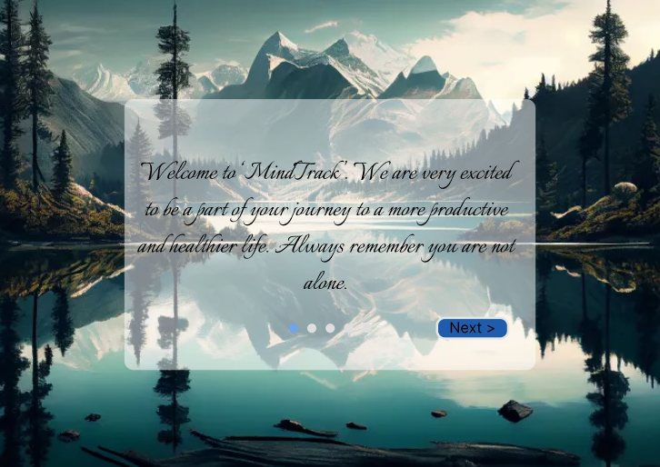

# MindTrack

MindTrack is a mental wellness and productivity companion designed to help students and employees manage stress, anxiety, burnout, and daily productivity from one personalized platform.

The project report describes a mobile-first experience that brings together wellness tracking, preventive guidance, productivity tools, and a bridge to professional support. The interface emphasizes calm visual design, low information density, accessible typography, and simple navigation.

## Prototype

*Click the image above to view the interactive prototype on Figma.*

## Project Goals

- Help users record mood, energy levels, and habits consistently.
- Provide personalized affirmations, tips, and achievable micro-goals.
- Connect mental wellness with focus and productivity workflows.
- Help users recognize mood and stress patterns through visual insights.
- Make professional consultation and crisis resources easier to reach.
- Encourage sustainable routines through habits, streaks, and rewards.
- Protect sensitive personal and wellness information.

## Planned Features

- User registration, authentication, profile management, and privacy settings
- Daily mood and energy logging with emoji or slider-based input
- Mood history, weekly summaries, and graphical trends
- AI-assisted daily affirmations, tips, and micro-goals
- Guided breathing exercises, short meditations, and calming activities
- Pomodoro-based focus timer and productivity session tracking
- Habit building with streaks and achievement badges
- Personalized dashboard and smart wellness insights
- Psychiatrist availability and consultation booking
- Emergency mode with hotline links and coping resources

## Design Direction

MindTrack uses a calming palette inspired by blues and greens, with warmer colors reserved for actions, warnings, and high-energy mood states. The proposed navigation uses five primary tabs to keep the main modules easy to reach:

1. Home or dashboard
2. Mood tracking
3. Productivity and focus
4. Insights
5. Profile and support

## Technology Direction

The project report identifies the following technologies for the broader application:

- Figma for high-fidelity UI design and interactive prototyping
- Flutter or React Native for cross-platform mobile development
- Firebase for authentication, cloud data, and scalable backend services
- SQLite for local persistence and offline-friendly data handling
- AI APIs or a rules engine for personalized suggestions and insights

## Current Prototype

The current repository contains the prototype entry page in [`index.html`](./index.html) and the Figma preview image in [`preview.png`](./preview.png). The Figma prototype is the primary demonstration of the planned user flows and interface.

## Disclaimer

MindTrack is a wellness and productivity concept. It is not a substitute for professional medical advice, diagnosis, or emergency services. Users experiencing an immediate crisis should contact local emergency services or a qualified crisis resource.
